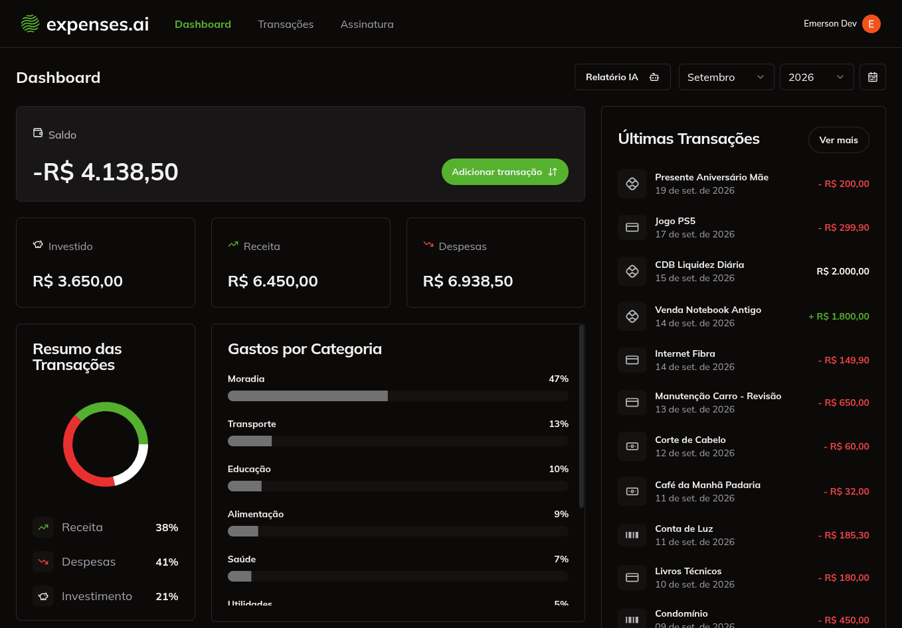
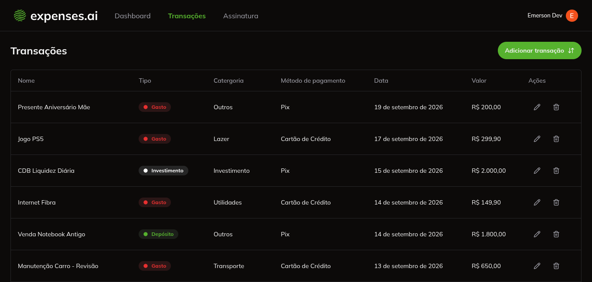
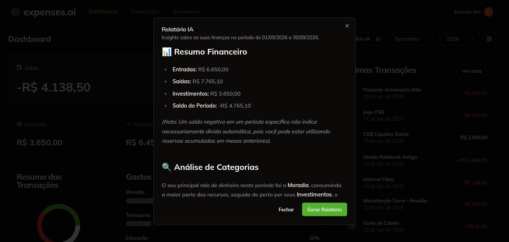
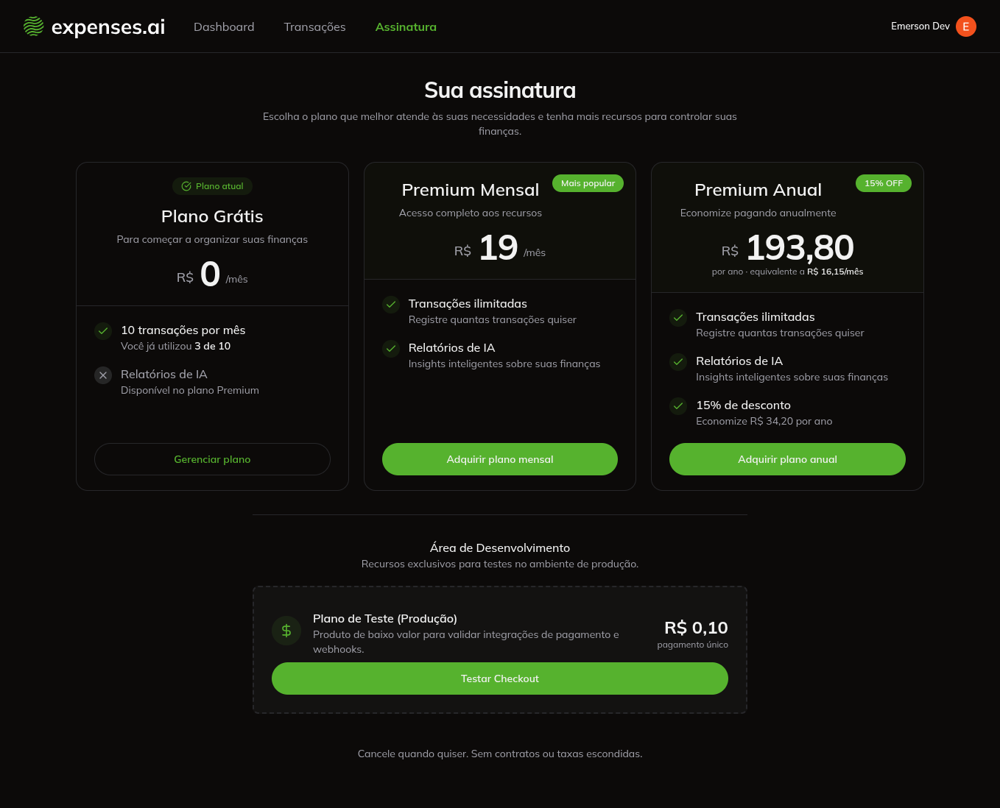
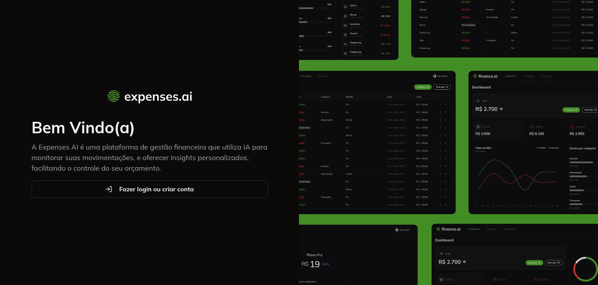

# Expenses AI

Plataforma de gestão financeira pessoal: registre receitas, despesas e investimentos, acompanhe o resumo do período e gere relatórios com inteligência artificial sobre os seus hábitos de gasto.

## Telas

> Coloque os prints em `docs/screenshots/` e descomente as linhas abaixo.

<!--  -->

<!--  -->

<!--  -->

<!--  -->

<!--  -->

## Funcionalidades

- **Dashboard** com saldo, receitas, despesas e investimentos do período, gráfico de resumo e gastos por categoria.
- **Período flexível**: seleção por mês e ano ou intervalo personalizado, com o período preservado na URL.
- **Transações**: cadastro, edição e exclusão, com categoria, forma de pagamento e data. Tabela no desktop e lista em cards no celular.
- **Relatório de IA**: análise do período em exibição gerada pelo Google Gemini, em streaming.
- **Planos e cobrança**: plano grátis limitado a 10 transações por mês; planos mensal e anual via Stripe, com portal do cliente para gerenciar a assinatura.

## Stack

| Camada       | Tecnologia                                |
| ------------ | ----------------------------------------- |
| Framework    | Next.js 14 (App Router) e React 18        |
| Linguagem    | TypeScript                                |
| Interface    | Tailwind CSS, shadcn/ui (Radix), Recharts |
| Banco        | PostgreSQL com Prisma                     |
| Autenticação | Clerk                                     |
| Pagamentos   | Stripe                                    |
| IA           | Google Gemini                             |
| Testes       | Vitest                                    |

## Como rodar

Pré-requisitos: Node.js 20+, Docker (ou um PostgreSQL próprio) e contas no Clerk, Stripe e Google AI Studio.

```bash
# 1. dependências
npm install

# 2. banco de dados local
docker compose up -d

# 3. variáveis de ambiente
cp .env.example .env
# preencha o .env com as chaves dos serviços

# 4. banco: aplica as migrações e gera o client do Prisma
npx prisma migrate dev

# 5. desenvolvimento
npm run dev
```

A aplicação sobe em <http://localhost:3000>.

### Variáveis de ambiente

Todas são obrigatórias — a aplicação não sobe sem elas, por decisão de projeto: é preferível falhar na subida a rodar com configuração pela metade. A lista completa e comentada está em [`.env.example`](.env.example).

Atenção ao `APP_URL`: é para onde o Stripe redireciona o cliente depois do pagamento. Em produção precisa ser o domínio real, sem barra no final.

### Webhook do Stripe

O plano do usuário é definido pelo webhook, não pela tela de checkout. Para testar o fluxo de assinatura localmente:

```bash
stripe listen --forward-to localhost:3000/api/webhooks/stripe
```

Use o segredo exibido pelo comando como `STRIPE_WEBHOOK_SECRET`.

## Scripts

| Comando              | O que faz                          |
| -------------------- | ---------------------------------- |
| `npm run dev`        | Sobe o ambiente de desenvolvimento |
| `npm run build`      | Compila para produção              |
| `npm start`          | Sobe a build de produção           |
| `npm run lint`       | Roda o ESLint                      |
| `npm test`           | Roda a suíte de testes             |
| `npm run test:watch` | Roda os testes em modo observação  |

## Testes

A suíte cobre as regras que erram em silêncio — aquelas que não quebram tela nenhuma, só mostram número errado:

- cálculo do período do dashboard (`app/_utils/dashboard-period.ts`);
- leitura do plano de assinatura (`app/_utils/subscription-plan.ts`);
- fórmulas do dashboard: saldo, percentual por tipo e fatia por categoria (`app/_data/get-dashboard/calculate.ts`);
- formatação de valores em real (`app/_utils/currency.ts`).

São funções puras: os testes rodam em segundos, sem banco, sem Clerk e sem Stripe.

## Estrutura

```
app/
  (home)/          dashboard e seus componentes
  transactions/    listagem, tabela e cards de transação
  subscription/    planos e checkout
  login/           entrada
  _actions/        server actions (criar, editar, excluir, Stripe)
  _components/     componentes compartilhados e a base de UI
  _data/           leitura de dados no banco
  _utils/          regras puras (período, plano, moeda)
  api/             rota do relatório de IA e webhook do Stripe
prisma/            schema e migrações
```
